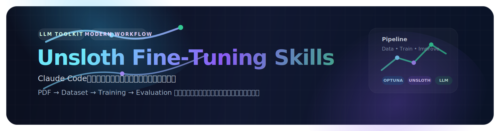

<p align="center">
  
</p>

<p align="center">
  Claude Code用のファインチューニングスキルスイート。PDFから学習データセットを作成し、Unslothを使用してLLMを効率的にファインチューニングできます。
</p>

## 概要

このスキルスイートは、4つの連携したスキルから構成され、エンドツーエンドのファインチューニングワークフローを提供します：

| スキル | 目的 | ステータス |
|--------|------|-----------|
| `unsloth_dataset_creator` | PDFから学習データセットを作成 | ✅ 完成 |
| `unsloth_trainer` | ハイパーパラメータ最適化付きでモデルをファインチューニング | ✅ 完成 |
| `unsloth_fine_tuning_orchestrator` | 完全なファインチューニングワークフローを統合 | ✅ 完成 |
| `unsloth_auto_improver` | モデルを評価し改善案を提示 | ✅ 完成 |

## クイックスタート

オーケストレーターを使用して完全なパイプラインを実行：

```python
from unsloth_fine_tuning_orchestrator import run_workflow

result = run_workflow(
    pdf_dir="./pdfs",
    output_dir="./output",
    base_model="unsloth/Llama-3.2-3B-Instruct",
    config={"target_samples": 1000},
    llm_provider="groq",
    llm_config={"api_key": "your-key", "model": "llama-3.1-70b-versatile"}
)
```

## インストール

```bash
# 依存関係をインストール
pip install unsloth datasets trl transformers
pip install optuna
pip install pdfminer.six tiktoken

# スキルパッケージをインストール
pip install -e .
```

## 使用方法

詳細な使用ガイドは [docs/fine-tuning-skills-usage.md](docs/fine-tuning-skills-usage.md) を参照してください。

## 個別スキル

### 1. データセットクリエーター

PDFから学習データセットを作成：

```python
from unsloth_dataset_creator import create_dataset

result = create_dataset(
    pdf_dir="./pdfs",
    output_dir="./dataset",
    config={"target_samples": 1000},
    llm_provider="groq",
    llm_config={"api_key": "your-key"}
)
```

**出力ファイル：**
- `dataset_train.jsonl` - 学習データ（90%）
- `dataset_eval.jsonl` - 評価データ（10%）
- `dataset_metadata.json` - 生成統計

### 2. トレーナー

ハイパーパラメータ探索付きでファインチューニング：

```python
from unsloth_trainer import fine_tune

result = fine_tune(
    train_dataset="./dataset_train.jsonl",
    eval_dataset="./dataset_eval.jsonl",
    output_dir="./models",
    base_model="unsloth/Llama-3.2-3B-Instruct"
)
```

**出力構造：**
```
output_dir/
├── best_model/              # 最良モデル
├── trials/trial_{n}/        # 試行ごとのチェックポイント
└── optuna_study.json        # 最適化結果
```

### 3. オーケストレーター

完全なワークフローを調整：

```python
from unsloth_fine_tuning_orchestrator import run_workflow

result = run_workflow(
    pdf_dir="./pdfs",
    output_dir="./output",
    base_model="unsloth/Llama-3.2-3B-Instruct",
    config={"target_samples": 1000},
    llm_provider="groq",
    llm_config={"api_key": "your-key"},
    optuna_config={"n_trials": 20, "max_epochs": 5}
)
```

### 4. 自動改善

モデルを評価し改善案を生成：

```python
from unsloth_auto_improver import evaluate_and_improve

result = evaluate_and_improve(
    model_path="./models/best_model",
    eval_dataset="./dataset_eval.jsonl",
    metric="exact_match",
    threshold=0.8
)
```

## テスト

```bash
# 全テストを実行
pytest tests/ -v

# 特定のスキルテストを実行
pytest tests/dataset_creator/ -v
pytest tests/trainer/ -v
pytest tests/orchestrator/ -v
pytest tests/auto_improver/ -v
```

**テスト結果：** 107テスト、全てパス ✅

## ディレクトリ構造

```
.claude/skills/
├── unsloth_dataset_creator/     # データセット作成
│   ├── __init__.py
│   ├── SKILL.md
│   ├── chunker.py
│   ├── pdf_processor.py
│   └── qa_generator.py
├── unsloth_trainer/             # モデルトレーニング
│   ├── __init__.py
│   ├── SKILL.md
│   ├── training_loop.py
│   └── optuna_config.py
├── unsloth_fine_tuning_orchestrator/  # ワークフロー統合
│   ├── __init__.py
│   └── SKILL.md
├── unsloth_auto_improver/       # 評価と改善
│   ├── __init__.py
│   ├── SKILL.md
│   └── evaluator.py
└── shared/                      # 共有ユーティリティ
    ├── __init__.py
    ├── config.py
    ├── paths.py
    └── run_id.py
```

## ワークフロー

オーケストレーターは完全なワークフローを調整：

1. **データセット作成**
   - PDFからテキストを抽出
   - ドキュメントをチャンク化
   - LLMを使用してQ&Aペアを生成
   - 学習/評価セットに分割

2. **トレーニング**
   - Optunaでハイパーパラメータ探索を実行
   - 複数試行で学習
   - 最良モデルを選択

3. **評価**（オプション）
   - 最良モデルを評価
   - 失敗を分析
   - 改善案を生成

## 設定

### 必要な環境変数

```bash
export GROQ_API_KEY="gsk_..."  # Q&A生成用
export HF_TOKEN="hf_..."       # モデルダウンロード用（オプション）
```

### データセットクリエーター設定

```python
config = {
    "use_thinking": True,      # thinkingフィールドを含める
    "target_samples": 1000     # 目標Q&Aペア数
}
```

### Optuna設定

```python
optuna_config = {
    "n_trials": 20,              # 試行回数
    "max_epochs": 5,             # 試行ごとの最大エポック
    "lora_ranks": [8, 16, 32],   # 試行するLoRAランク
    "learning_rates": [1e-5, 5e-5, 1e-4]
}
```

## ハイパーパラメータ探索空間

| パラメータ | 型 | 範囲 |
|-----------|------|-------|
| learning_rate | float | 1e-5 - 1e-3 (log) |
| lora_rank | categorical | 8, 16, 32, 64 |
| lora_alpha | categorical | 16, 32, 64, 128 |
| lora_dropout | float | 0.0 - 0.1 |
| batch_size | categorical | 1, 2, 4 |
| num_epochs | int | 1 - 5 |

## トラブルシューティング

### よくある問題

| 問題 | 解決策 |
|------|--------|
| メモリ不足 | batch_sizeを減らすかlora_rankを下げる |
| 学習が遅い | n_trialsやmax_epochsを減らす |
| APIエラー | GROQ_API_KEYとモデル名を確認 |
| インポートエラー | すべての依存関係をインストール |

詳細なトラブルシューティングは [docs/fine-tuning-skills-usage.md](docs/fine-tuning-skills-usage.md) を参照してください。

## 開発

```bash
# 開発環境をセットアップ
git clone https://github.com/coolerking/unsloth-finetune-skills.git
cd unsloth-finetune-skills
pip install -e ".[dev]"

# テストを実行
pytest tests/ -v

# リントを実行
ruff check .
black .
```

## ライセンス

MIT License - 詳細は [LICENSE](LICENSE) ファイルを参照してください。

## 貢献

1. リポジトリをフォーク
2. 機能ブランチを作成
3. 変更を加える
4. テストを追加
5. プルリクエストを送信

## サポート

問題や質問がある場合：
- [使用ガイド](docs/fine-tuning-skills-usage.md) を確認
- 個別のSKILL.mdファイルをレビュー
- GitHubでissueを開く

---

**作成者：** coolerking
**リポジトリ：** https://github.com/coolerking/unsloth-finetune-skills
